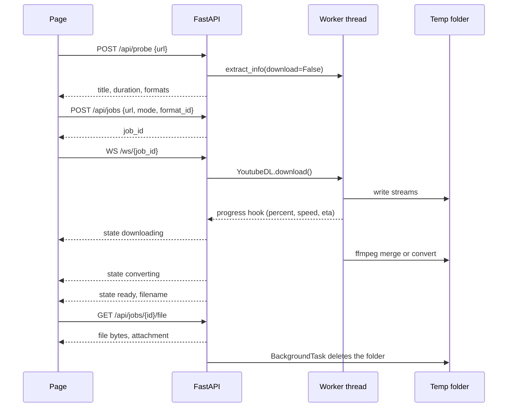

# Design: local web page for yt-dlp

Date: 2026-09-18
Status: approved

## 1. Purpose

Give one person a local web page that downloads a video from a URL. The page offers three outputs: a merged MP4 file, an MP3 audio file, or a format that the person selects. The page shows live progress. The server keeps no file after the browser download completes.

The application runs on one machine, for one person, and it binds to the loopback address only.

## 2. Constraints

1. The server listens on `127.0.0.1` only. It never binds to `0.0.0.0`.
2. The server holds a file only between the start of a job and the end of the browser download.
3. The page shows percent, speed, and time left while the download runs.
4. There is no build step for the front end. The page uses plain HTML, CSS, and JavaScript.
5. yt-dlp is used as a Python library. The application never builds a shell command from a URL.
6. The first version has no queue, no playlist support, and no history.

## 3. Environment

The target machine has these programs. The application does not install them.

| Program | Version at design time |
|---|---|
| Python | 3.13.7 |
| yt-dlp | 2025.10.14 |
| ffmpeg | 8.0.1 full build |

Python dependencies: `fastapi`, `uvicorn[standard]`, `yt-dlp`. Test dependencies: `pytest`, `httpx`.

## 4. Why a temporary file is necessary

The person asked for three things at the same time: live progress, a merged MP4, and no file kept on the server. The first two need a complete file on disk.

An MP4 file holds its index, the `moov` atom, at the end of the file. A player needs that index to seek. The ffmpeg option `-movflags +faststart` moves the index to the front, and that option makes a second pass over the finished file. A second pass needs a complete file. Therefore the merge cannot write into an HTTP response.

Live progress comes from the yt-dlp `progress_hooks` callback. The callback reports the bytes received, the total bytes, the speed, and the time left. The page receives this data on a WebSocket, which is a separate channel from the file transfer. If the download body were the HTTP response itself, there would be no earlier moment to report progress.

The design therefore writes the file to a private temporary folder, reports progress on a WebSocket, and deletes the folder after the browser download completes.

## 5. Architecture

One FastAPI process serves the API and the static page.

```
yt-dlp/
  app/
    main.py          FastAPI app, routes, lifespan, static mount
    config.py        settings
    jobs.py          Job record, JobStore, progress fan-out
    downloader.py    yt-dlp wrapper: probe and run
    cleanup.py       janitor task
  static/
    index.html
    app.js
    style.css
  tests/
  requirements.txt
  README.md
```

yt-dlp blocks the thread while it downloads. The route starts the download with `asyncio.to_thread`, so the event loop stays free.

## 6. Components

### 6.1 config.py

| Setting | Value |
|---|---|
| `HOST` | `127.0.0.1` |
| `PORT` | `8000` |
| `TEMP_ROOT` | a folder named `ytdlp-web` in the system temporary folder |
| `JOB_TTL_SECONDS` | 1800 |
| `CLEANUP_INTERVAL_SECONDS` | 60 |

### 6.2 jobs.py

A `Job` record holds these fields: `id`, `url`, `mode`, `format_id`, `state`, `percent`, `speed`, `eta`, `title`, `filename`, `file_path`, `error`, `created_at`, and `workdir`.

The states are `queued`, `downloading`, `converting`, `ready`, `error`, and `expired`. The permitted changes are:

```
queued -> downloading -> converting -> ready
any state that is not terminal -> error
ready -> expired
queued or downloading or converting -> expired
```

`JobStore` keeps the records in a dictionary behind a lock. It supplies `create`, `get`, `update`, `remove`, and `expired_ids`.

The progress callback runs in the worker thread, but the WebSocket waits on the event loop. The callback therefore calls `loop.call_soon_threadsafe` to put each update into an `asyncio.Queue`. This call is necessary, because an `asyncio.Queue` is not thread safe.

The job id is a random UUID in hexadecimal form. The work directory name comes from the job id only. No part of a path comes from the client.

### 6.3 downloader.py

`probe(url)` calls `extract_info(url, download=False)`. It returns the title, the duration, the thumbnail, and a cleaned list of formats. Each format entry holds the format id, the extension, the resolution, the frame rate, the video codec, the audio codec, the file size, and a note.

`build_opts(mode, format_id, workdir, hooks)` returns the yt-dlp options.

| Mode | Format string | Post-processing |
|---|---|---|
| `video` | `bv*+ba/b` | merge to MP4, ffmpeg argument `-movflags +faststart` |
| `audio` | `ba/b` | `FFmpegExtractAudio`, codec `mp3`, quality 192 |
| `format` | `<id>+ba/<id>` | none |

The `format` mode uses the pattern `<id>+ba/<id>`. This pattern removes a decision from the server. yt-dlp tries the selected format plus the best audio first. If the selected format already holds audio, that first attempt fails, and yt-dlp falls back to the selected format alone. The server therefore never needs to know whether the format holds audio.

The `format` mode does not force a container. If the selected video format and the audio format do not fit in an MP4 container, yt-dlp writes an MKV file. This is correct behaviour, and the page shows the real file name.

`run(job, store)` executes the download in a worker thread. It records the final path from the `postprocessor_hooks` callback. If that callback gives no path, the function scans the work directory and selects the one file that is not a `.part` file and not a `.ytdl` file.

To cancel a job, the server sets a flag on the job record. The progress callback reads the flag on each call, and it raises a `JobCancelled` exception. That exception stops the yt-dlp run from inside. `run` catches the exception, deletes the work directory, and removes the job.

### 6.4 cleanup.py

An asynchronous task runs every 60 seconds. It deletes each work directory that is older than the TTL, and it marks the job `expired`. A delete that fails is retried on the next cycle.

### 6.5 main.py

| Method | Path | Purpose |
|---|---|---|
| GET | `/` | the page |
| POST | `/api/probe` | body `{url}`, returns title, duration, thumbnail, formats |
| POST | `/api/jobs` | body `{url, mode, format_id}`, returns `{job_id}` |
| WS | `/ws/{job_id}` | progress messages |
| GET | `/api/jobs/{id}` | the job state, for the polling fallback |
| GET | `/api/jobs/{id}/file` | the file, with `Content-Disposition: attachment` |
| DELETE | `/api/jobs/{id}` | cancel the job and delete the folder |

The file route returns a `FileResponse` with a `BackgroundTask`. The task deletes the work directory after the last byte leaves.

A video title can hold a character that is not ASCII. The file route therefore sends both forms of the file name in the header: an ASCII fallback in `filename=`, and the UTF-8 form in `filename*=UTF-8''<percent-encoded>`, as RFC 5987 defines. A browser that understands the second form uses it. An old browser uses the first form.

The application lifespan starts the janitor task, and it stops the task at shutdown. At startup the application checks that ffmpeg is present. If ffmpeg is absent, the application refuses to start and prints the reason.

### 6.6 Front end

One page holds a URL box, a Check button, the title and the thumbnail, three choices, a progress bar, and a Download button. The third choice opens a table of formats.

The page opens a WebSocket when a job starts. If the socket closes before the job ends, the page polls `GET /api/jobs/{id}` every 2 seconds. The job continues in both cases.

## 7. Data flow



## 8. Error handling

| Failure | Server action | Result on the page |
|---|---|---|
| Bad URL, private video, geographic block | catch `DownloadError`, set state `error` | the yt-dlp message, word for word |
| ffmpeg is absent | refuse to start | a clear line in the console |
| the WebSocket drops | no action, the job continues | the page polls every 2 seconds |
| the person presses Cancel | set the cancel flag, the hook stops the run | the job goes, and the folder is deleted |
| the disk is full | catch `OSError`, set state `error` | the error text |
| the person clicks Download two times | the first send deleted the folder and the record | HTTP 404 |
| the record says `ready`, but the file is absent | the file check fails | HTTP 410 Gone |
| the job is not yet `ready` | the state check fails | HTTP 409 |
| an unknown job id | no record in the store | HTTP 404 |

## 9. Limits of this design

1. If the process stops between the download and the delete, the folder stays until the janitor runs again, or until Windows clears the temporary folder.
2. Antivirus software can hold a file handle open, and the delete then fails. The janitor retries the delete.
3. The loopback binding is the only access control. A tunnel or a reverse proxy in front of this server removes that control, and any client can then use the machine and the bandwidth.
4. A 4K video needs the video stream, the audio stream, and the merged output on the disk at the same time. Plan for about 2.5 times the size of the final file.
5. The job records live in memory. A restart of the server loses every job.

## 10. Test plan

The tests use no YouTube URL. They stay fast, and a change on a video site does not break them.

1. Unit tests for `build_opts`. Each of the three modes returns the correct option dictionary.
2. Unit tests for `JobStore`. The state changes are correct, and an old job expires.
3. Unit tests for the output file lookup. A folder that holds a `.part` file and a finished file gives the finished file.
4. An integration test. A pytest fixture serves a one second MP4 over local HTTP. yt-dlp accepts any URL, so the test exercises the real download path, the real ffmpeg MP3 conversion, and the real file lookup.
5. API tests with the FastAPI `TestClient`. The tests cover the job lifecycle, and they prove that the file route deletes the folder and then answers 410.
6. One manual check with a real URL, done by the person at the end.

## 11. Out of scope

A queue, playlist support, a download history, a database, authentication, subtitles, and a thumbnail embed. Each of these is a separate change.
